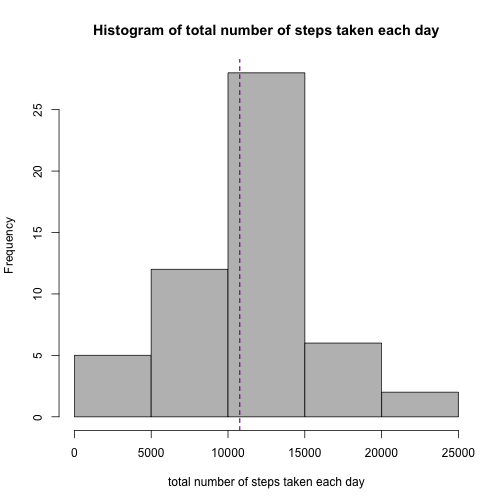
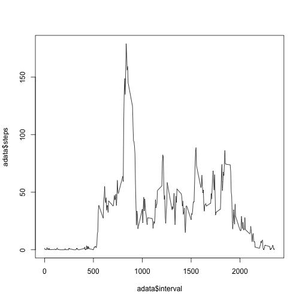
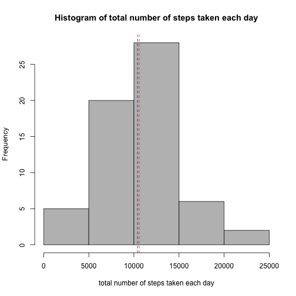
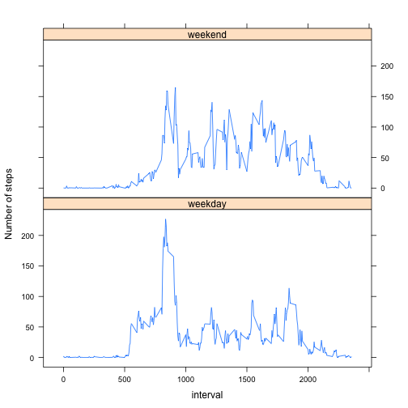

Reproducible Research - assignment 1 - analyse activity monitoring data
========================================================
loading and preprocessing the data:

```r
data <- read.csv("activity.csv")
```
what is mean total number of steps taken per day?

```r
total <- aggregate(data$steps, list(data$date), sum)
colnames(total) <- c("date", "totalNumOfSteps")
hist(total$totalNumOfSteps,  main = paste("Histogram of total number of steps taken each day"), xlab= "total number of steps taken each day", border="black", col="gray")
m <- mean(total$totalNumOfSteps, na.rm=TRUE)
me <- median(total$totalNumOfSteps, na.rm=TRUE)
cat("Mean: ", m)
```

```
## Mean:  10766
```

```r
cat("Median: ", me)
```

```
## Median:  10765
```

```r
abline(v=m,col="red" , lty=2)
abline(v=me,col="blue" , lty=2)
```

 
What is the average daily activity pattern?

```r
data[is.na(data)] <- 0
adata <- aggregate(data$steps, list(data$interval), mean)
colnames(adata) <- c("interval", "steps")
plot(adata$interval, adata$steps, type="l")
```

 

```r
maxStepsInterval<- adata[which.max(adata$steps),1]
print(maxStepsInterval)
```

```
## [1] 835
```
Imputing missing values

```r
##question1
data <- read.csv("activity.csv")
NAs <- which(is.na(data), TRUE)
l <- nrow(NAs)
print(l)
```

```
## [1] 2304
```

```r
##question2 adata (mean of steps per day)- question 3
complete <- data
complete[NAs[,1],]$steps <- adata$steps
##question4
completeTotal <- aggregate(complete$steps, list(complete$date), sum)
colnames(completeTotal) <- c("date", "totalNumOfSteps")
##print(total)
mc<- mean(completeTotal$totalNumOfSteps)
mec <- median(completeTotal$totalNumOfSteps)
hist(completeTotal$totalNumOfSteps,  main = paste("Histogram of total number of steps taken each day"), xlab= "total number of steps taken each day", border="black", col="gray")
cat("Mean: ", mc)
```

```
## Mean:  10581
```

```r
cat("Median: ", mec)
```

```
## Median:  10395
```

```r
abline(v=mc,col="red" , lty=2)
abline(v=mec,col="blue" , lty=2)
```

 
Are there differences in activity patterns between weekdays and weekends?

```r
##question1
complete$dayType <- ifelse(weekdays(as.Date(complete$date)) %in% c("Saturday", "Sunday"),"weekend", "weekday")
##question2
acomplete <- aggregate(complete$steps, list(complete$interval, complete$dayType), mean)
colnames(acomplete) <- c("interval", "day","steps")
library(lattice)
xyplot(steps ~ interval | day, data=acomplete,type="l", ylab="Number of steps", layout=c(1, 2))
```

 

library(knitr)
knit2html("PA1_template.Rmd")


